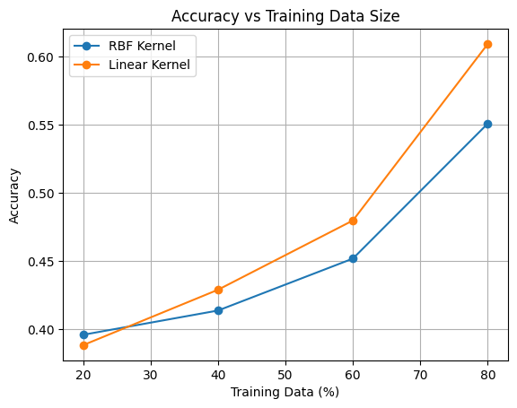

# Brain Tumor Detection using SVM + PCA

---

## Overview

This project focuses on classifying brain MRI images into different tumor types using Support Vector Machine (SVM) with Principal Component Analysis (PCA) for dimensionality reduction.

The objective is to analyze how different SVM kernels and varying amounts of training data affect model performance.

---

## Dataset

The dataset consists of brain MRI images categorized into:

* No Tumor
* Pituitary Tumor
* Glioma Tumor
* Meningioma Tumor

Dataset source: https://www.kaggle.com/datasets/sartajbhuvaji/brain-tumor-classification-mri

---

## Methodology

### 1. Image Preprocessing

* Converted to grayscale
* Resized to 200 × 200
* Normalized pixel values

### 2. Feature Extraction

* Images flattened into vectors

### 3. Dimensionality Reduction

* PCA applied with 98% variance retention

### 4. Classification

* SVM with:

  * RBF Kernel
  * Linear Kernel

---

## 2. Kernel Comparison: RBF vs Linear SVM

### Methodology

The model was trained using both RBF and Linear kernels. PCA was applied before training, and evaluation was performed on a separate testing dataset to avoid data leakage.

---

### Results

| Metric         | RBF Kernel | Linear Kernel |
| -------------- | ---------- | ------------- |
| Training Score | 0.9690     | 1.0000        |
| Testing Score  | 0.7183     | 0.7360        |

---

### Explanation of Results

The RBF kernel maps data into a higher-dimensional space and can model complex, non-linear relationships. The linear kernel assumes that the data is linearly separable.

After applying PCA, the dataset becomes less noisy and more structured, making it closer to linearly separable.

Observations:

* The linear kernel performs slightly better on test data.
* The RBF kernel shows slight overfitting, indicated by higher training accuracy but lower testing accuracy.

---

### Conclusion

* Linear kernel achieved better generalization in this case.
* PCA improves linear separability of the data.
* Higher training accuracy does not necessarily indicate better performance.

---

## 3. Effect of Training Data Size on SVM

### Methodology

The model was trained using different portions of the training dataset:

* 20%
* 40%
* 60%
* 80%

The testing dataset was kept fixed and completely separate.

---

### Results

| Training Data (%) | RBF Accuracy | Linear Accuracy |
| ----------------- | ------------ | --------------- |
| 20%               | 0.396        | 0.388           |
| 40%               | 0.414        | 0.429           |
| 60%               | 0.452        | 0.480           |
| 80%               | 0.551        | 0.609           |

---

### Accuracy Plot

---

### Explanation of Trend

At 20% training data:

* The model has limited exposure to patterns.
* This leads to underfitting and low accuracy.

At 40% to 60% training data:

* The model begins to learn meaningful patterns.
* Accuracy improves steadily.

At 80% training data:

* The model has sufficient data.
* It learns decision boundaries effectively and achieves better performance.

---

### Kernel Behavior

RBF Kernel:

* Handles complex patterns.
* Improves gradually with more data.
* May show slight fluctuations.

Linear Kernel:

* More stable.
* Performs well after PCA.
* Outperforms RBF in this case.

---

### Conclusion

* Increasing training data improves performance.
* Small datasets lead to underfitting.
* PCA combined with linear SVM is effective for structured data.
* More training data leads to better generalization.

---

## Final Metrics

### RBF Kernel

* Accuracy: 0.7183
* F1 Score: 0.6840
* Sensitivity (Recall): 0.7183
* Specificity: 0.9043

### Linear Kernel

* Accuracy: 0.7360
* F1 Score: 0.6928
* Sensitivity (Recall): 0.7360
* Specificity: 0.9100

---

## Important Note

The test dataset was not used during training. PCA was fitted only on the training data and then applied to the test data. This ensures that there is no data leakage and that evaluation results are reliable.

---

## Credits

Original dataset and base implementation:
https://github.com/Adityathere/Brain-Tumor-Detection-Using-SVM

---

## Author

 Vineet-mig
